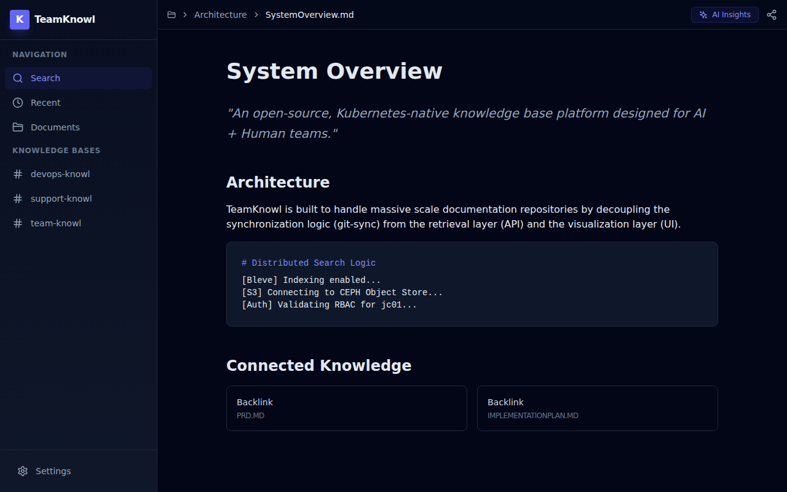

# TeamKnowl


**TeamKnowl** is an open-source, Kubernetes-native knowledge base platform designed for **AI + Human** teams. It provides an Obsidian-like experience for humans while exposing a highly structured, agent-friendly API for LLMs.

## 🚀 Key Features

- **Kubernetes-Native**: Managed by the TeamKnowl Operator.
- **Git-Sync Integration**: Automated documentation synchronization from any Git repository.
- **AI-First API**: Dedicated `/v1/context` endpoints for LLM context injection.
- **Obsidian-like UI**: Beautiful, dark-themed Markdown interface with backlink visualization.
- **Enterprise Storage**: Powered by CEPH/S3 for high availability and scale.

## 🖼️ Dashboard Preview



## 🛠️ Components

- **Operator**: Go-based controller managing the KnowledgeBase lifecycle.
- **API**: High-performance Go service for content retrieval and indexing.
- **UI**: Next.js + Tailwind CSS dashboard for humans.
- **Helm**: Production-ready deployment charts.

## 📦 Build & Run

To build all components locally:

```bash
docker compose build
```

To run the full stack (API + UI):

```bash
docker compose up -d
```

## 📄 License

MIT License - Copyright (c) 2026 John K Johansen
