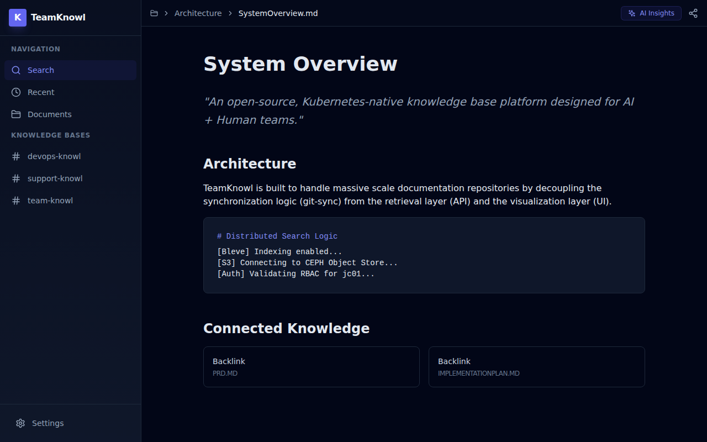

# TeamKnowl


**TeamKnowl** is an open-source, Kubernetes-native knowledge base platform designed for **AI + Human** teams. It provides an Obsidian-like experience for humans while exposing a highly structured, agent-friendly API for LLMs.

## 🚀 Key Features

- **Kubernetes-Native**: Managed by the TeamKnowl Operator.
- **Git-Sync Integration**: Automated documentation synchronization from any Git repository.
- **AI-First API**: Dedicated `/v1/context` endpoints for LLM context injection.
- **Obsidian-like UI**: Beautiful, dark-themed Markdown interface with backlink visualization.
- **Enterprise Storage**: Powered by CEPH/S3 for high availability and scale.
- **Unified Auth**: Standardized on `harbor-global-pull` secrets using robot accounts.

## 🖼️ Dashboard Preview



## 🛠️ Components

- **Operator**: Go-based controller managing the KnowledgeBase lifecycle.
- **API**: High-performance Go service for content retrieval and indexing.
- **UI**: Next.js + Tailwind CSS dashboard for humans.
- **Helm**: Production-ready deployment charts.

## 📦 Build & Run

### Docker Compose (Local Dev)
To build and run all components locally:
```bash
docker compose up --build -d
```

### Kubernetes (Production)
1. **Build and push images** to your registry (e.g., Harbor). 
   **Tip**: Use tags instead of `latest` for consistent rollouts.
```bash
# Example for v1.0.1
cd ~/tmp-build/operator && sudo docker build -t harbor.ai-agents.private/teamknowl/operator:v1.0.1 . && cd ..
cd ~/tmp-build/api && sudo docker build -t harbor.ai-agents.private/teamknowl/api:latest . && cd ..
cd ~/tmp-build/ui && sudo docker build -t harbor.ai-agents.private/teamknowl/ui:latest . && cd ..

# Login and Push
sudo docker login harbor.ai-agents.private
sudo docker push harbor.ai-agents.private/teamknowl/operator:v1.0.1
sudo docker push harbor.ai-agents.private/teamknowl/api:latest
sudo docker push harbor.ai-agents.private/teamknowl/ui:latest
```

2. **Install the Operator** using Helm:
```bash
helm install teamknowl-operator ./helm/teamknowl-operator -n knowl --create-namespace
```

3. **Deploy a KnowledgeBase instance**:
Create a `my-kb.yaml`:
```yaml
apiVersion: core.teamknowl.io/v1alpha1
kind: KnowledgeBase
metadata:
  name: e2e-docs
  namespace: knowl
spec:
  repository:
    repositoryUrl: "https://github.com/jensjohansen/teamknowl.git"
    branchName: "main"
  storage:
    provider: "local"  # Or "s3" for enterprise scale
  userInterface:
    enabled: true
```
Apply it:
```bash
kubectl apply -f my-kb.yaml
```

## 📄 License

MIT License - Copyright (c) 2026 John K Johansen
