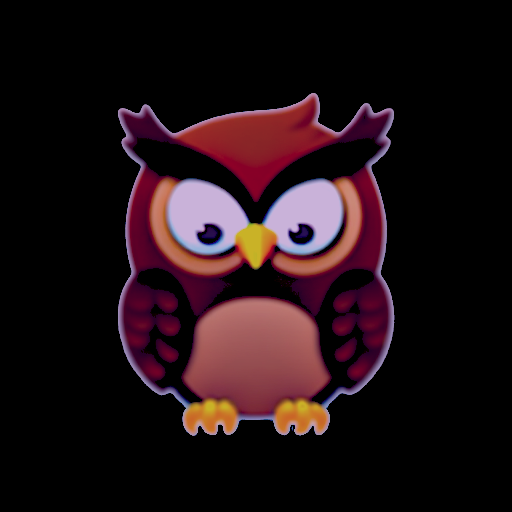

# Product Requirements Document: TeamKnowl (v3.0)
**Author**: Zencoder AI
**Status**: Strategic Draft (Stack-Ranked)

## 1. Executive Summary
**TeamKnowl** is an open-source, MIT-licensed, Kubernetes-native knowledge base platform designed to empower AI-augmented engineering teams. It replicates the "connected brain" experience of networked thought but is architected for the scalability, security, and high-concurrency needs of a modern cloud-native organization.

## 2. Stack-Ranked Strategic Requirements

### 1. Data Sovereignty & Collaborative Persistence
**Requirement**: Knowledge artifacts must be persisted in a simple, robust method that avoids vendor lock-in and facilitates real-time multi-user collaboration.
- **Business Value**: To ensure the long-term durability and interoperability of the organization's total knowledge asset while delivering a "Google Docs-like" seamless editing experience. By using open-standard **JSON Document Storage** with **Full-Version Snapshots**, the system provides near-instant history retrieval and high-speed data access for both humans and AI agents.
- **Strategic Inspiration**: Modern collaborative editors and unstructured document stores.

### 2. Networked Knowledge Discovery (Cross-Linking)
**Requirement**: The system must provide a fast, intuitive method for creating cross-linked associations between distinct information artifacts.
- **Business Value**: To ensure that relevant context is always discoverable, reducing time-to-knowledge for both human and AI team members. This prevents information silos where critical design docs are disconnected from related incident reports or SOPs.
- **Strategic Inspiration**: Obsidian's implementation of **Wikilinks** (`[[note]]`) and **Backlinks** ("What links here").
- **External Ref**: [Obsidian Internal Links](https://help.obsidian.md/Linking+notes+and+files/Internal+links)

### 3. Structured Knowledge Classification (Metadata)
**Requirement**: The system must support the addition of machine-readable metadata to documents and artifacts for tagging and classification.
- **Business Value**: To enable high-fidelity automated filtering, searching, and precision context injection for AI agents. This allows teams to programmatically manage knowledge (e.g., "Find all active design docs for the Auth service").
- **Strategic Inspiration**: Obsidian's use of **YAML Frontmatter** and **Properties** to classify knowledge artifacts.
- **External Ref**: [Obsidian Properties](https://help.obsidian.md/Editing+and+formatting/Properties)

### 4. Granular Knowledge Atomicity (Block-Level Support)
**Requirement**: The ability to reference and reuse specific "blocks" (paragraphs, code snippets, or warnings) across multiple documents.
- **Business Value**: To ensure that a single update to a critical "source of truth" (e.g., a security warning) is reflected everywhere it is referenced. This also enables AI agents to retrieve highly specific context without ingesting unrelated data.
- **Strategic Inspiration**: **Roam Research** and **Logseq**.

### 5. Visual Process & Architecture Mapping (Diagramming)
**Requirement**: Native support for creating and rendering visual diagrams within documentation artifacts.
- **Business Value**: To reduce the cognitive load required to understand complex system architectures and workflows. This allows engineers to maintain diagrams "as code" alongside their text, ensuring visual aids are as version-controlled and up-to-date as the documentation itself.
- **Strategic Inspiration**: Obsidian's native **Mermaid.js** integration.
- **External Ref**: [Obsidian Mermaid Support](https://help.obsidian.md/Editing+and+formatting/Advanced+formatting#Mermaid)

### 6. Lifecycle-Aware Documentation (Versioning)
**Requirement**: Native integration with Git versioning (branches and tags) to manage documentation for different software releases.
- **Business Value**: To ensure that engineers and AI agents are always consuming the correct documentation for their specific cluster environment. This prevents errors caused by using outdated SOPs or design patterns.
- **Strategic Inspiration**: **Wiki.js** and **Docusaurus**.

### 7. Semantic Knowledge Discovery (Advanced Search)
**Requirement**: Ability to discover related information through conceptual similarity, not just keyword matches.
- **Business Value**: To help team members find relevant context that may not be explicitly linked. This reduces the time spent "searching for the right word" and allows for the discovery of related solutions across different services or teams.
- **Strategic Inspiration**: Obsidian's search capabilities and various community plugins for **Semantic/Vector Search**.

### 8. Collective Semantic Mapping (Representation)
**Requirement**: The system must provide a graphic or logical representation of the knowledge base that is consistent and meaningful for both AI agents and human users.
- **Business Value**: To ensure any member of an AI-augmented team can visualize the interconnections between disparate systems and identify critical knowledge clusters or documentation gaps.
- **Strategic Inspiration**: Obsidian's **Graph View** which treats artifacts as nodes and links as edges.
- **External Ref**: [Obsidian Graph View](https://help.obsidian.md/Plugins/Graph+view)

### 9. Data-Driven Knowledge Insights (Querying)
**Requirement**: A method for querying the metadata and properties across the entire knowledge base to generate dynamic views.
- **Business Value**: To transform the knowledge base from a static library into a dynamic database (e.g., "Show me a table of all services currently in 'Alpha' status"). This allows for real-time reporting on the status of projects, systems, and team efforts.
- **Strategic Inspiration**: Obsidian's community-driven **Dataview** ecosystem.

### 10. Contextual Collaboration (Inline Feedback)
**Requirement**: A method for providing inline feedback and comments on documentation artifacts that is compatible with a Git-as-source architecture.
- **Business Value**: To facilitate real-time review and feedback loops within the platform, keeping the discussion attached to the artifact and out of fragmented chat logs.
- **Strategic Inspiration**: **Confluence** and **Google Docs**.

### 11. Knowledge Capture Standardization (Templates)
**Requirement**: The ability to define and apply reusable structures for common documentation types.
- **Business Value**: To ensure consistency across the organization for repetitive knowledge artifacts (e.g., Incident Post-mortems, RFCs, Onboarding docs). This reduces "blank page" friction and ensures that both humans and AI agents are providing/consuming data in a predictable format.
- **Strategic Inspiration**: Obsidian's **Templates** core plugin.
- **External Ref**: [Obsidian Templates](https://help.obsidian.md/Plugins/Templates)

### 12. Temporal Knowledge Tracking (Journaling)
**Requirement**: Support for time-indexed logs and notes associated with specific dates.
- **Business Value**: To provide an audit trail of engineering activities and decisions over time. This is critical for capturing "ephemeral knowledge" during incidents or daily standups that often gets lost in chat logs.
- **Strategic Inspiration**: Obsidian's **Daily Notes** core plugin.
- **External Ref**: [Obsidian Daily Notes](https://help.obsidian.md/Plugins/Daily+notes)

### 13. Scalable Logical Hierarchies (Hierarchical Support)
**Requirement**: Support for structured, hierarchical naming conventions alongside a flat link-based network.
- **Business Value**: To allow for organizational clarity as the knowledge base scales to thousands of documents, providing a predictable structure for enterprise-wide discovery.
- **Strategic Inspiration**: **Dendron** and **Wiki.js**.

### 14. Spatial System Modeling (Canvas)
**Requirement**: An infinite spatial workspace for laying out and connecting notes, media, and cards.
- **Business Value**: To facilitate high-level brainstorming and system mapping that traditional linear documentation cannot capture. This allows architects and teams to "see" the big picture of a system's components and their relationships in a non-linear, spatial layout.
- **Strategic Inspiration**: **Obsidian Canvas**.
- **External Ref**: [Obsidian Canvas](https://obsidian.md/canvas)

## 3. Deployment & Strategic Goals
- **Commercially Permissive**: Released under the **MIT License** to ensure unrestricted commercial use and open contribution.
- **Kubernetes-Native**: Deployed and managed as a cluster service to provide native scalability, self-healing, and security (RBAC/NetworkPolicy) that local-first tools cannot achieve.
- **AI-First Retrieval**: A headless-ready architecture optimized for autonomous agents to interact with the knowledge graph with low latency and high relevance.
- **Substrate for KaiManager**: Acts as the authoritative document and context store for **KaiManager**, providing the "Case File" persistence layer.

## 4. Success Criteria
1.  **Organizational Adoption**: A team can share a single, synchronized "connected brain" across multiple pods without information drift.
2.  **AI Integration**: An autonomous agent can successfully navigate from an alert to its related troubleshooting documentation purely via logical associations (links).
3.  **Future-Proofing**: The entire knowledge base can be exported, searched, and managed using standard Git/CLI tools without any proprietary dependency.
