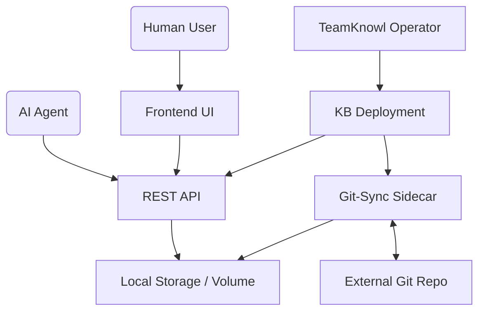

# Technical Design: TeamKnowl

## 1. System Overview
**TeamKnowl** consists of three primary components:
- **Operator**: A Go-based Kubernetes operator (using Kubebuilder) that manages the lifecycle of knowledge bases.
- **Git-Sync Service**: A sidecar or dedicated service that keeps the local storage in sync with one or more Git repositories.
- **Frontend/API Service**: A lightweight web application (React/Next.js) and a REST API for human and AI interaction.

## 2. Component Architecture


## 3. Data Schema: The KnowledgeBase CRD
```yaml
apiVersion: teamknowl.io/v1alpha1
kind: KnowledgeBase
metadata:
  name: devops-kb
spec:
  repository:
    url: "https://github.com/org/devops-kb.git"
    secretRef: "git-credentials"
    branch: "main"
  syncInterval: "5m"
  ui:
    theme: "dark"
    enabled: true
  api:
    enabled: true
    headless: true
```

## 4. Storage Architecture
- **Object Storage (S3-Compatible)**: Primary storage for Markdown files, indexed artifacts, and AI metadata.
- **Preferred Provider**: CEPH Object Gateway (RGW) for scalable, enterprise-class infrastructure.
- **Fallbacks**: MinIO (for local development or edge clusters) or cloud-provider S3 services.
- **Philosophy**: Cloud-agnostic and scalable enterprise-class design, ensuring no vendor lock-in and high availability across any Kubernetes environment.
- **Benefits**:
    - **Shared Access**: Simplifies concurrent access for multiple AI agents and UI replicas without `ReadWriteMany` PVC complexity.
    - **Enterprise Scalability**: Handles multi-petabyte document collections efficiently via CEPH's distributed architecture.
    - **Durability**: Leverages CEPH's sophisticated replication and erasure coding for mission-critical data protection.

## 5. Distributed Indexing & High Availability (HA)
To ensure enterprise-class horizontal scalability and self-healing, TeamKnowl implements the following:
- **Sharded Index Architecture**: The Bleve in-memory index is sharded across multiple pod replicas. Each shard is independently rebuildable from the primary S3 object store.
- **Self-Healing Index Rebuild**: When a new pod or node becomes available (e.g., after a failure or scale-up), it automatically initiates an index rebuild from the S3 bucket's latest state.
- **Leaderless Replication**: Multiple replicas of the same shard can exist across different nodes. A "Readiness" probe ensures a pod only receives traffic once its local index shard is fully synchronized.
- **Event-Driven Cache Invalidation**: S3 "Bucket Notification" events (or Git-Sync completion signals) are broadcast to all API replicas to trigger targeted re-indexing and cache invalidation.
- **Resilient Distributed Caching**: 
    - For high-frequency metadata, a distributed cache (e.g., Redis with HA Sentinel) is used.
    - Cache state is treated as ephemeral; all entries are verifiable against the CEPH source of truth.
    - In the event of a cache node failure, the system automatically falls back to S3/Index retrieval while the cache warms up, ensuring zero-downtime availability.
- **Stateless API Design**: The API remains stateless, allowing Kubernetes to load-balance requests across any healthy replica with a synchronized index and cache.

## 5. Security & Isolation
- **NetworkPolicies**: Restrict access to the API and Git-Sync services.
- **Secrets Management**: Git credentials and API keys are managed using standard Kubernetes Secrets.
- **RBAC**: Kubernetes RBAC for managing the CRDs.

## 6. AI Agent Integration
- **Context API**: Endpoints to fetch a "flat" version of documentation suitable for LLM context windows.
- **Automatic Metadata**: The API service will inject `lastModified`, `author`, and `links` into the Markdown metadata (Frontmatter) to help AI agents reason about the content.
