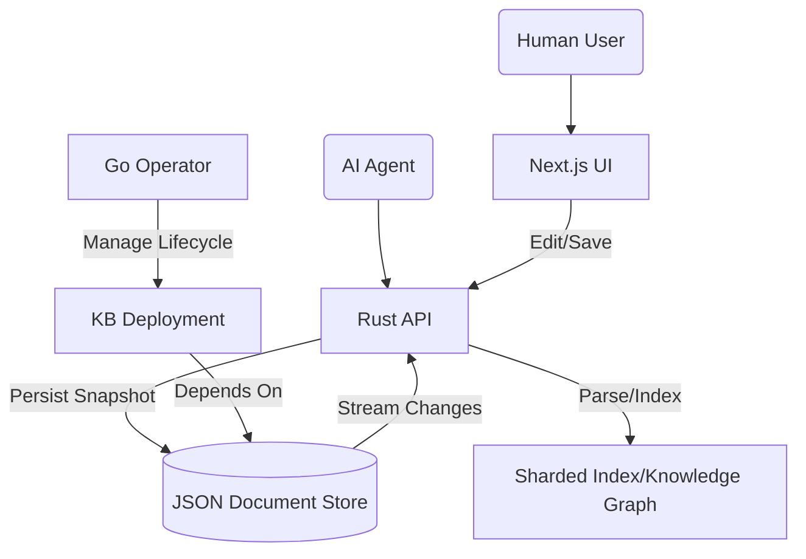

# Technical Architecture & Design: TeamKnowl (v2.0)
**Author**: Zencoder AI
**Status**: Strategic Foundation

## Executive Summary
TeamKnowl is a **Kubernetes-native knowledge management platform** designed to provide a distributed, high-performance "connected brain" for AI-augmented engineering teams. It bridges the gap between the personal productivity of graph-based note-taking tools and the enterprise requirements of scalability, security, and versioned persistence. By leveraging a **Rust-based indexing engine** and a **stateless API architecture** backed by a **JSON Document Store**, TeamKnowl ensures that knowledge remains a live, queryable, and durable asset for both human and machine collaborators.

## 1. Architectural Overview

```mermaid
graph TD
    User(Human User) --> FE[Next.js UI]
    Agent(AI Agent) --> API[Rust API]
    FE -- Edit/Save --> API
    API -- Persist Snapshot --> DS[(JSON Document Store)]
    DS -- Stream Changes --> API
    API -- Parse/Index --> Index[Sharded Index/Knowledge Graph]
    Operator[Go Operator] -- Manage Lifecycle --> KBInstance[KB Deployment]
    KBInstance -- Depends On --> DS
```

## 2. Glossary of Domain Terms

To ensure a shared understanding among all stakeholders, the following terms are used throughout this document:

- **Knowledge Artifact**: A discrete unit of information, typically stored as a Markdown file.
- **Resource Reference (Internal Link)**: A symbolic link between two knowledge artifacts.
- **Inbound Reference (Backlink)**: A reference that points *to* the current knowledge artifact from another artifact.
- **Outbound Reference (Outgoing Link)**: A reference from the current artifact *to* another resource.
- **Knowledge Graph**: The network formed by knowledge artifacts (nodes) and their references (edges).
- **Header Metadata (Frontmatter)**: Structured key-value pairs at the beginning of an artifact used for classification.
- **Atomic Fragment (Block)**: A granular, addressable section within a larger knowledge artifact (e.g., a specific paragraph or code snippet).
- **Spatial Workspace (Canvas)**: A non-linear, infinite-coordinate layout for visually organizing artifacts.
- **Transclusion**: The inclusion of a knowledge artifact or atomic fragment within another artifact by reference, without duplication.
- **Operator**: A Kubernetes-native pattern for managing the lifecycle of a complex application.

## 3. Strategic Technical Decisions (ADRs)

### 3.1. Deployment Model: Kubernetes-Native Operator
- **Decision**: Manage the system via a **Kubebuilder-based Operator (Go)** and **Helm v3**.
- **Reasoning**: To provide automated lifecycle management for multiple `KnowledgeBase` instances. This moves the operational burden from the user to the platform.

### 3.2. Primary Language Stack: Rust & TypeScript
- **Decision**: **Rust (Axum/Tokio)** for the API/Indexing engine; **TypeScript (Next.js)** for the UI.
- **Reasoning**: Rust provides memory safety and high-concurrency performance required for real-time sharded indexing. TypeScript ensures type safety for complex UI state management (Graph views, real-time editing).

### 3.3. Persistence Tier: JSON Document Store (S3/RethinkDB)
- **Decision**: Use a **JSON Document Store** (e.g., RethinkDB or S3-backed JSON objects) as the primary source of truth for both content and metadata.
- **Reasoning**: Delivers the highest **Functional Simplicity** for knowledge workers (real-time collaboration, no "Sync" ceremony) while maintaining **Strategic Simplicity** via open-standard, unstructured JSON. This model natively supports rich operational metadata (version history, AI processing logs) that Git cannot easily represent.

## 4. Non-Functional Requirements (NFRs)

### 4.1. Scalability & Availability
- **Horizontal Scaling**: All API and UI pods must be stateless, allowing Kubernetes to scale replicas based on load.
- **High Availability**: Minimum `replicaCount: 2` for all core services. The Document Store must be configured for cluster-wide high availability.
- **Index Sharding**: Search indices (Tantivy) must be sharded to allow for large knowledge bases.

### 4.2. Performance Targets
- **Read Latency**: Artifact retrieval from Document Store < 50ms.
- **Search Latency**: Full-text and metadata queries < 100ms.
- **UI Responsiveness**: Initial load < 1s; Graph rendering < 2s for 1000+ nodes.

### 4.3. Durability & Versioning
- **Full-Version Snapshots**: Every artifact update results in a new full-version snapshot in the Document Store.
- **Near-Instant Recovery**: Rolling back to a previous version is an O(1) operation (loading a snapshot) rather than a compute-heavy O(N) diff reconstruction.
- **Zero Data Loss**: Writes are acknowledged only after being persisted to the distributed store.

## 5. Security & Quality Requirements
- **Identity & Isolation**: Namespace isolation and Kubernetes-native RBAC.
- **Credential Management**: Secret injection via Kubernetes Secrets; no hardcoded credentials.
- **Quality Gates**: Mandatory static analysis (clippy/lint), 80% test coverage, and documented logic proofs for every milestone.

## 6. Implementation of Strategic Requirements

### 6.1. Persistence: JSON Document Store & Snapshots (PRD #1)
- **Read/Write Path**: The Rust API performs all operations against the high-speed JSON Document Store (e.g., RethinkDB or S3-backed objects). 
- **Versioning**: Uses a **Snapshot-first strategy**. Instead of storing line-by-line diffs, the system stores complete versions of the JSON artifact. This keeps compute costs low and retrieval speeds consistent regardless of document history depth.
- **Rich Metadata**: Operational metadata (authorship, view counts, AI-derived tags) is stored within the same JSON document or a linked metadata object, ensuring a single atomic source of truth.

### 6.2. Networked Discovery: Resource References & Inbound Mapping (PRD #2)
- **Indexing**: A background worker in the Rust API parses JSON content for symbolic references.
- **Reverse Index**: An adjacency matrix is stored in the sharded index to track all **Inbound References** (backlinks).

### 6.3. Structured Classification: Header Metadata (PRD #3)
- **Indexing**: JSON keys and header metadata are indexed as individual fields in Tantivy, enabling high-performance filtering and automated knowledge insights.

### 6.4. Granular Atomicity: Fragment Support (PRD #4)
- **Identification**: Atomic fragments (blocks) are identified by stable hashes of their content.
- **Referencing**: The API supports fragment-level retrieval from the JSON store to enable **Transclusion** without data duplication.

### 6.5. Visual Mapping: Schema & Graph Views (PRD #5, #8)
- **Graph Generation**: The adjacency matrix is converted into a standard Nodes/Edges JSON structure for the UI.
- **Rendering**: Diagrammatic schemas and the collective knowledge graph are rendered client-side in the Next.js UI.

### 6.6. Lifecycle-Awareness: Reference Versioning (PRD #6)
- **Snapshot Navigation**: The API allows the UI to request specific version IDs or timestamps from the Document Store, enabling "Time Travel" through the artifact's history.

### 6.7. Collaborative Feedback: Inline References (PRD #10)
- **Storage**: Comments are stored as linked JSON objects in the Document Store, allowing for real-time notifications and threaded discussions.
